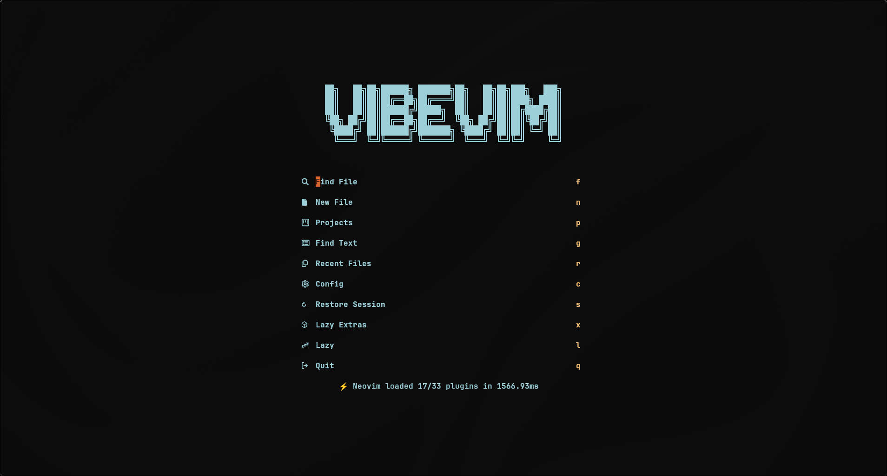
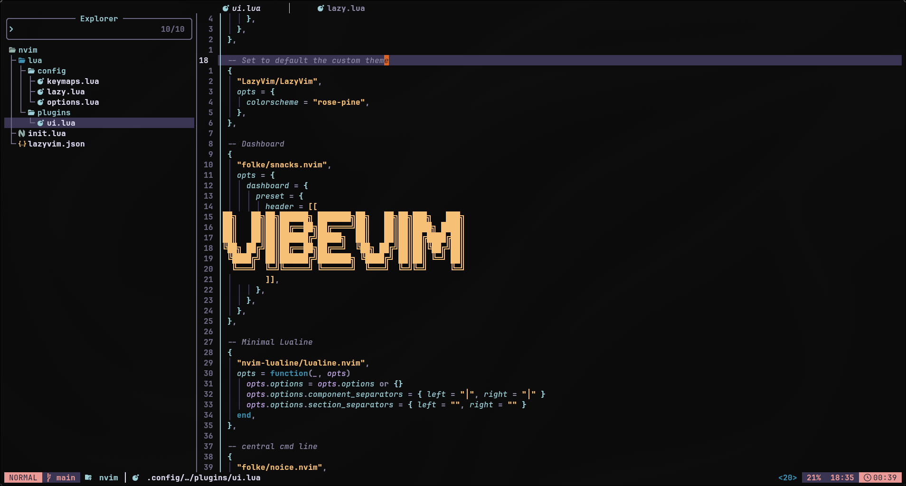
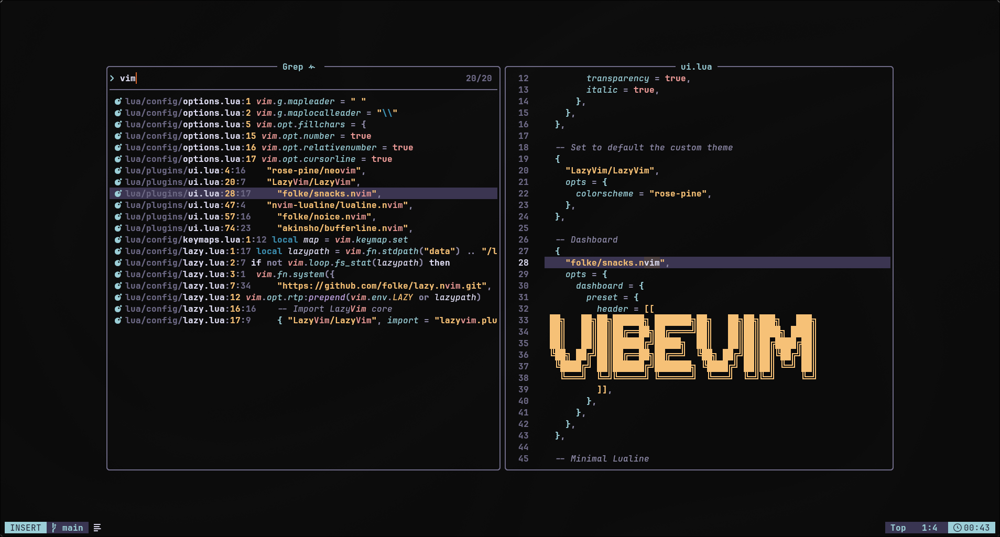

# 🌊 VibeVim

> A minimal, elegant, and functional Neovim setup built on top of [LazyVim](https://github.com/LazyVim/LazyVim).


VibeVim is my personal take on Neovim. It leverages the robust and modern foundation of LazyVim but completely reimagines the visual and interaction philosophy. The goal is simple: **make Neovim feel focused, calm, and beautiful**, without sacrificing speed or practicality.

## ✨ The Vibe

VibeVim isn't trying to be the most feature-packed distribution. It’s a curated experience designed for developers who want a polished IDE right out of the box, minus the visual noise. 

* **Curated Aesthetic:** A softer overall look, custom dashboard branding, and a tweaked statusline/tabline to drastically reduce clutter.
* **Intentional UI:** Minimal but expressive. You get the power of LazyVim without feeling overwhelmed by UI elements.
* **Ready for Work:** Sane defaults with LSP, Treesitter, and formatters pre-configured and ready to go.
* **Highly Extensible:** A simple, readable codebase that makes it the perfect starting point for your personal IDE.

---

## 📸 Preview

| Dashboard | Editing Experience | Workflow & Fuzzy Finding |
| :---: | :---: | :---: |
|  |  |  |

---

## 🚀 Getting Started

### Prerequisites

Before diving in, ensure you have the following installed:
* **Neovim** (>= 0.9.0)
* **Git**
* A **Nerd Font** (enabled in a terminal you actually enjoy using)
* **Ripgrep** (for blazingly fast searches)
* A working clipboard provider

### 📦 Installation

1. **Backup your current setup**:
   ```bash
   mv ~/.config/nvim ~/.config/nvim.bak
   mv ~/.local/share/nvim ~/.local/share/nvim.bak
   mv ~/.local/state/nvim ~/.local/state/nvim.bak
   mv ~/.cache/nvim ~/.cache/nvim.bak
   ```

2. **Clone VibeVim**:
   ```bash
   cd ~/.config/nvim
   git clone https://github.com/DavideSciaulino/VibeVim.git
   ```

3. **Launch Neovim**:
   ```bash
   nvim
   ```
   *Plugins will be installed automatically on your first launch.*

> **💡 PRO TIP: Safe Test Install**
> Want to try VibeVim without touching your current config? Run it in isolation using `NVIM_APPNAME`:
> ```bash
> git clone https://github.com/DavideSciaulino/VibeVim.git ~/.config/VibeVim
> NVIM_APPNAME=VibeVim nvim
> ```

---

## 📂 Architecture

VibeVim is intentionally easy to read and tweak. Here is the core structure:

```text
~/.config/nvim
├── init.lua                # Entry point
└── lua
    ├── config
    │   ├── keymaps.lua     # Custom shortcuts & workflow improvements
    │   ├── lazy.lua        # Bootstraps plugin manager & LazyVim
    │   └── options.lua     # Core editor behavior & visual defaults
    └── plugins
        └── ui.lua          # The heart of VibeVim: theme, dashboard, and UI
```

---

## ⌨️ Keybindings

VibeVim relies on the `<Space>` key as the `Leader`. Here are some of the most useful defaults to get you moving:

| Shortcut | Action |
| :--- | :--- |
| `<leader>ff` | Find files |
| `<leader>fg` | Live grep |
| `<leader>e` | Toggle file explorer |
| `<leader>bd` | Delete current buffer |
| `<leader>qq` | Quit all |

---

## 🛠️ Customization & Roadmap

If you like the base idea, you can shape VibeVim into your own editor in minutes. The `plugins/ui.lua` file is your playground for colorschemes, dashboard headers, and statuslines.

**Future plans include:**
* Language-specific presets (Web, Python, Lua).
* An optional "ultra-minimal" mode.
* More refined dashboard actions.
* Better documented plugin groups.

---

## 🤝 Contributing & Inspiration

VibeVim is built on top of the excellent [LazyVim](https://github.com/LazyVim/LazyVim) ecosystem. It exists because I wanted a setup that felt more personal. 

Suggestions, issues, and improvements are always welcome! If you have an idea that makes VibeVim cleaner, more elegant, or more useful, feel free to open an issue or a pull request.

---

## 📄 License

MIT
